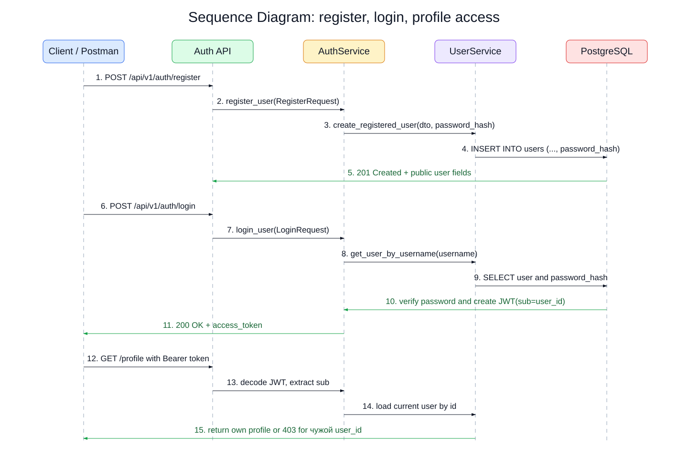
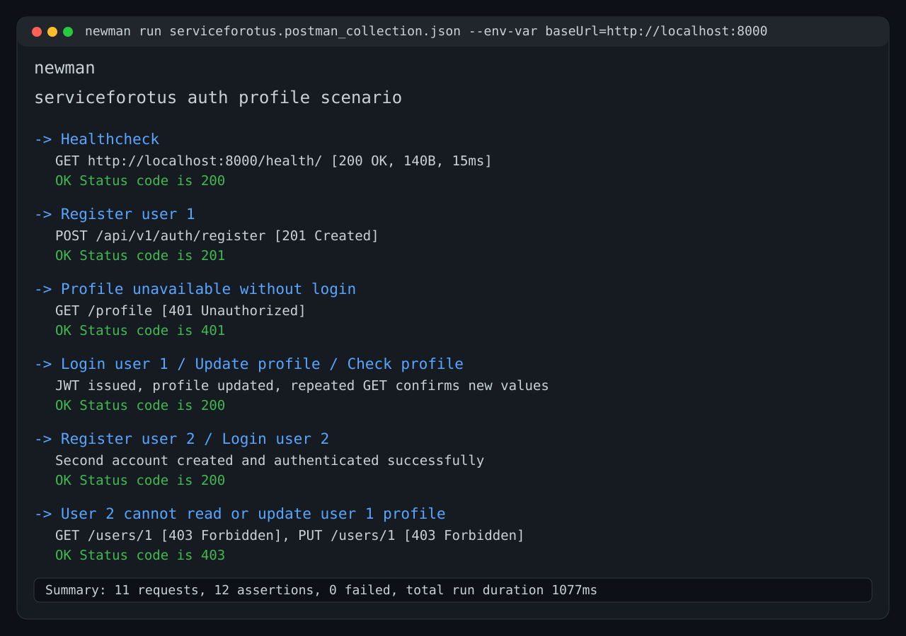

# serviceforotus

REST-сервис на FastAPI c регистрацией, логином по JWT и доступом к профилю только для владельца.

## Архитектура

Приложение реализовано как один backend-сервис `users-service`. Он отвечает за регистрацию пользователя, аутентификацию, выпуск JWT-токена, чтение и обновление собственного профиля. Внешний трафик приходит через `nginx-ingress`, данные хранятся в PostgreSQL, конфигурация передается через `ConfigMap`, а секреты подключения к БД и JWT key через `Secret`. Первичная схема БД поднимается Kubernetes `Job` с Alembic.



## API

Базовый URL для Kubernetes: `http://arch.homework`

- `POST /api/v1/auth/register` - регистрация пользователя
- `POST /api/v1/auth/login` - логин и получение JWT
- `GET /profile` - получить свой профиль
- `PUT /profile` - изменить свой профиль
- `GET /users/{id}` - получить профиль только при совпадении `id` с токеном
- `PUT /users/{id}` - изменить профиль только при совпадении `id` с токеном
- `DELETE /users/{id}` - удалить профиль только при совпадении `id` с токеном
- `GET /health/` - healthcheck для Postman
- `GET /live` - liveness
- `GET /ready` - readiness c проверкой БД

## Локальный запуск

```bash
cp .env.example .env
docker compose up --build db migrate app
```

После запуска сервис доступен на `http://localhost:8000`.

## Kubernetes

Namespace для установки:

```bash
kubectl create namespace otus
```

Установка ingress controller:

```bash
helm repo add ingress-nginx https://kubernetes.github.io/ingress-nginx/
helm repo update
helm upgrade --install nginx ingress-nginx/ingress-nginx -n otus -f chart/nginx-ingress.yaml
```

Отдельный API gateway не используется, маршрутизация выполняется `nginx-ingress`.

Установка PostgreSQL из Helm:

```bash
helm upgrade --install users-db oci://registry-1.docker.io/bitnamicharts/postgresql -n otus -f helm/postgresql-values.yaml
```

`values.yaml` для БД: `helm/postgresql-values.yaml`

Сборка образа:

```bash
docker build -t e1name/forotus:users-crud .
```

Если используется Minikube и образ локальный:

```bash
minikube image load e1name/forotus:users-crud
```

Команда применения первоначальных миграций:

```bash
kubectl apply -n otus -f chart/configmap.yaml -f chart/secret.yaml -f chart/migration-job.yaml
kubectl wait -n otus --for=condition=complete job/users-service-migrations --timeout=120s
```

Команда установки приложения из манифестов:

```bash
kubectl apply -n otus -f chart/configmap.yaml -f chart/secret.yaml -f chart/migration-job.yaml -f chart/deployment.yaml -f chart/service.yaml -f chart/ingress.yaml
```

Если хост еще не прописан локально:

```text
127.0.0.1 arch.homework
```

## Проверка Postman/Newman

Коллекция: `serviceforotus.postman_collection.json`

В коллекции используется базовый URL `http://arch.homework` и покрывается сценарий:

- регистрация пользователя 1
- проверка, что профиль недоступен без логина
- логин пользователя 1
- изменение профиля пользователя 1
- проверка, что профиль изменился
- регистрация пользователя 2
- логин пользователя 2
- проверка, что пользователь 2 не может читать и изменять профиль пользователя 1

Запуск Newman:

```bash
newman run serviceforotus.postman_collection.json
```

Для локальной проверки без ingress:

```bash
newman run serviceforotus.postman_collection.json --env-var baseUrl=http://localhost:8000
```

Для проверки через port-forward ingress controller:

```bash
kubectl port-forward -n otus svc/nginx-ingress-nginx-controller 8080:80
newman run serviceforotus.postman_collection.json --env-var baseUrl=http://arch.homework:8080
```

Скрин успешного прогона Newman:



Текстовый вывод также сохранен в `newman-run.txt`.

## Манифесты

Kubernetes-манифесты находятся в директории `chart/`.
