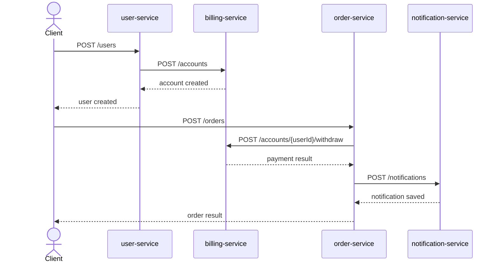
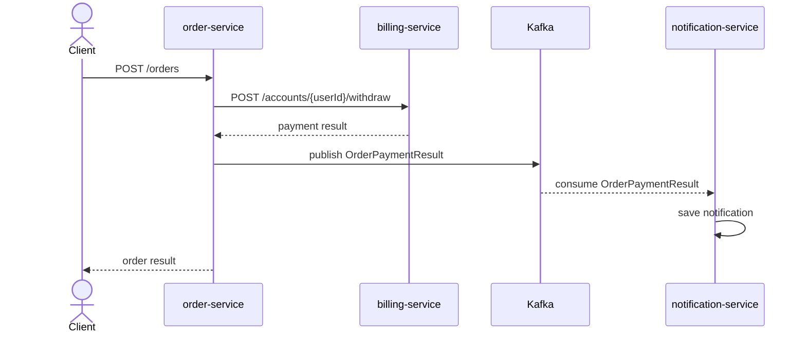
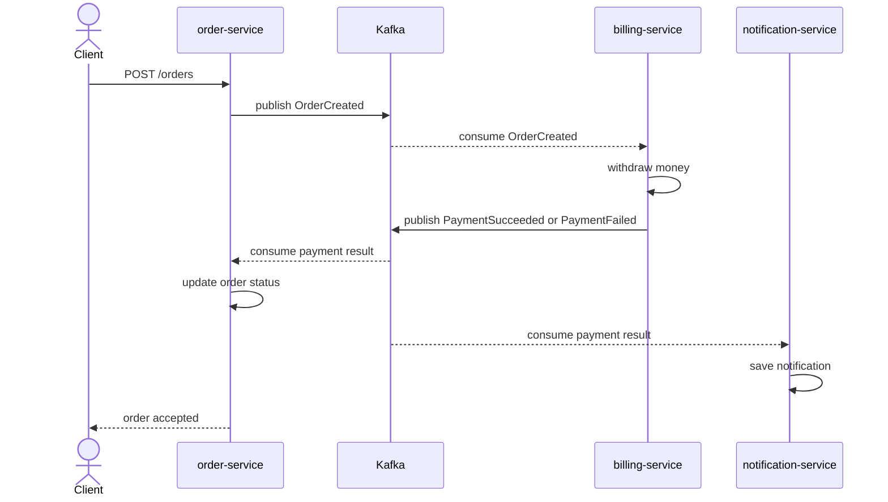

# Architecture

В этом файле описываются варианты взаимодействия сервисов для теоретической части ДЗ.

## Вариант 1. Только HTTP

Все сервисы взаимодействуют синхронно по HTTP.



## Вариант 2. HTTP + broker for notifications

Платеж выполняется синхронно по HTTP, уведомление доставляется асинхронно через брокер.



Этот вариант выбран для практической реализации.

## Вариант 3. Event Collaboration

Сервисы реагируют на события друг друга. Центрального синхронного процесса меньше, больше асинхронного обмена.



## Вариант 4. Итоговый выбор

Для реализации выбран вариант 2:

```text
HTTP + Kafka for notifications
```

Причины:

- результат оплаты нужен order-service сразу;
- уведомление можно выполнять асинхронно;
- схема проще полноценного Event Collaboration;
- архитектура потом расширяется до Saga Orchestration.
